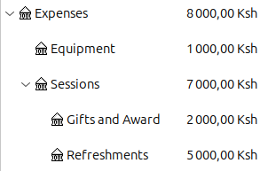
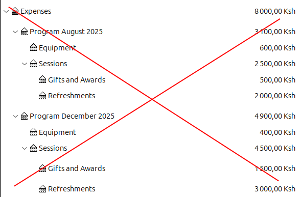
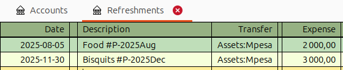
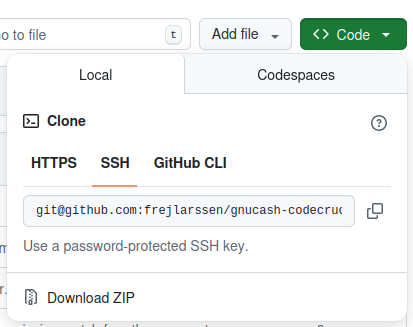
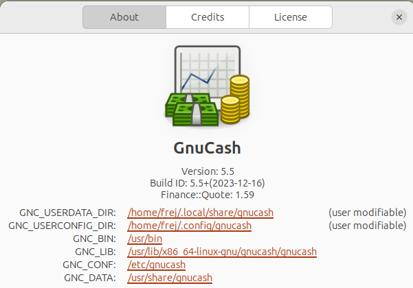

# Reports for GnuCash customized for CodeCrucible

  * [Motivation](#motivation)
  * [GnuCash](#gnucash)
  * [Reports](#reports)
  * [Installation](#installation)

## Motivation

Before installing you might wonder why you should do it. This section explains why.

Accounts in GnuCash are organized in an account tree. The accounts for expenses might for example be organized like this:

<figure>
    
    <figcaption>Figure 1: Expenses.</figcaption>
</figure>


CodeCrucible runs multiple programs, for example one in August 2025 and one in December 2025. We would like to seperate the expenses between these programs. One **bad** way to do this would be:

<figure>
    
    <figcaption>Figure 2: Bad example.</figcaption>
</figure>

Instead, we want to organize the account tree as in Figure 1. We differ between accounts when we do transactions by "tagging" them in the description:

<figure>
    
    <figcaption>Figure 3: Transactions with tags for accounts.</figcaption>
</figure>

The reports in this file allows us to use these tags to see total expenses for the program `#P-2025Aug` (August holiday 2025) etc.

## GnuCash

Make sure you download [GnuCash](https://gnucash.org) and learn the basics, for example using the tutorial.

## Reports

This is repository contains one custom reports for GnuCash 5, customized for CodeCrucible.

The report is:

* Transaction Report Extended (`transaction-extended.scm`)

(More fancy ones will be added later. (Pie-charts etc would be cool.))

## Installation

The specific instructions below on how to load custom reports are based on more generic instructions available on the [wiki](https://wiki.gnucash.org/wiki/Custom_Reports#Loading_Your_Report). Check there if something doesn't work.

The commands in this guide assumes you are using Linux, but the steps for other operating systems should be similar.
### Step 1. Clone this repository

Either clone the repository or download the zip and unzip the folder in some working directory.



Enter the repository with

```bash
cd gnucash-codecrucible-reports
```


### Step 2. Link the files

1. Start GnuCash
2. Go to menu Help - About

3. In the About GnuCash dialog, locate the entry for **GNC_USERDATA_DIR**. It's the first entry in the list. Copy the link.

4. Replace `{GNC_USERDATA_DIR}` with the path you copied and run the command below to create a link to the file:
    ```bash
    ln -s $(pwd)/transaction-extended.scm {GNC_USERDATA_DIR}/transaction-extended.scm
    ```
    while standing in the folder `gnucash-codecrucible-reports`.
    (If you copied the path by right clicking, make sure to remove `file://` so that the path starts with `/home`.)

    On my system, the full command is:

    ```bash
    ln -s "$(pwd)/transaction-extended.scm" ~/.local/share/gnucash/transaction-extended.scm
    ```

### Step 3. Edit config file

Go back to the _About GnuCash_ dialog from Step 2. 

This time locate the second entry **GNC_USERCONFIG_DIR**. Click on the link to open the directory.

If there is **already** an existing file called _config-user.scm_ in the directory, then you need to edit that file and add whichever of these lines match the report(s) you want to enable:

`(load (gnc-build-userdata-path "transaction-extended.scm"))`

If there **isn't** a file called _config-user.scm_ in that directory, then you can either create one and put the above line in it or you can simply use the file that came with the zip file.

### Step 5. Restart GnuCash

After restarting GnuCash, the custom "Transaction Report Extended" should be available under the Reports - Experimental menu.

Open the options and select accounts and date similar to the normal transaction report. It should show totals per program by default. For more configuration, check below.

# (The stuff below is from the repository I forked, so it might not be up to date. The two reports are quite similar so the instructions probably works for both./Frej)

## The two reports

### Transaction Report Extended

**Filename**: transaction-extended.scm

**Description**: Based on the built-in transaction report, it provides these additional features:
+ a Sort by Substring option which includes a regular expression match similar to the one offered for the transaction filter. That feature is the generic version of the Transaction Report with Tags.
+ a new option on the display tab called "Use More Permissive Match for Other Account Name and Code". This option enables a more permissive match for the other account name and code in order to reduce the number of "split transaction" account names with multisplits.

### Transaction Report with Tags

**Filename**: transaction-tags.scm

**Description**: An earlier version of transaction-extended.scm that focusses on Sort by tags specifically. It was releases as a proof-of-concept to provide some basic features related to the long-discussed request of being able to use orthogonal categories, classes, tags or "analytical dimensions" to retrieve and group transactions across several general ledger accounts. See https://bugs.gnucash.org/show_bug.cgi?id=113772

**Limitations**: This custom report is not a feature-rich solution. It only provides one type of report (similar to the existing transaction report) and does not provide any feature to "bulk manage" existing or future user-defined tags. So there is no feature to bulk rename, bulk move or bulk delete tags for instance. All changes to the data file (adding and changing tags) are done manually by the user. This feature only provides a custom report that uses tags as created by the user.

## Report Features 

### Transaction Report Extended

(TO DO. But it basically works similar to "Transaction Report with Tags", but with capability of searching for any string.)

### Transaction Report with Tags

A new tags sort key is made available in the primary and secondary key drop-down list, in the sorting options.


To see the transactions grouped by tags, one should select that key as well as enable the subtotal for the level selected.

More options are made available at the bottom of the sorting options.


#### Tag Prefix

- By default, the sort engine will look for tags starting with #. However to accomodate the ability to tag multiple dimensions (meaning several tags per transaction), the user is able to change that prefix to any character (even the # could be changed). For instance you could use tags for a project dimension, for instance #P-XXX where XXX is your project reference, so #P-001 #P-002 etc. You could also use tags for different departments so #D for instance, #D-MKTING #D-FINANCE, etc. Then to run a report on the project dimension, set the tag to #P, for the department dimension set the tag to #D. 
- A checkbox allows to select the option to remove the prefix from the subtotal heading, so #D-FINANCE would simply show as FINANCE as the heading for instance (assuming #D- is entered as prefix)
- The tag search is first applied to the split memo, then if no match the transaction notes, then if no match the transaction description. Only the first matched tag (as per the prefix) is considered.

#### No-Match Heading
This is the heading that will be used for the subtotal group listing transactions with no match. A checkbox allows to automatically add the prefix to it or not.

#### Examples
Here is an example of a report sorted with the defaults on first level. Second level is sorted by account. I am using 2 tags in this sample file: #P-Anna and #P-Bob. Untagged transactions are listed at the bottom in the No Match # section.


Here is an example where I change the headings with these options.


Now my headings are a cleaner Anna, Bob and Nobody.


It is possible to remove the transactions with no matching tags by using the existing transaction filter (filter tab). Simply put the same tag prefix (# or whatever else you are using) in the Transaction Filter field.


Here only Anna and Bob are listed. No-match "Nobody" is no longer there.


Now I only want to see unmatched transactions.


These are just transactions that are not assigned to anybody


I could show Anna and Nobody, excluding Bob from the view (his transactions are excluded, not in nobody)


Here is just Anna and Nobody


Many more variations are possible, thanks to the wonderfull filter feature. 
