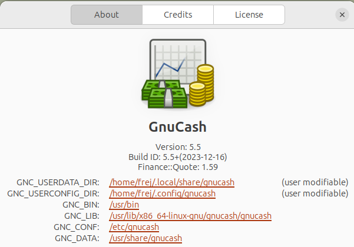

# Manual Setup

Use these instructions if the automatic setup didn't work.

The instructions below are based on more generic instructions available on the [GnuCash wiki](https://wiki.gnucash.org/wiki/Custom_Reports#Loading_Your_Report). Check there if something doesn't work.

## Step 1. Link the files

1. Start GnuCash
2. Go to menu Help - About

3. In the About GnuCash dialog, locate the entry for **GNC_USERDATA_DIR**. It's the first entry in the list. Copy the link.

4. Replace `{GNC_USERDATA_DIR}` with the path you copied and run the command below to create a link to the file:

    ```bash
    ln -s $(pwd)/transaction-extended.scm {GNC_USERDATA_DIR}/transaction-extended.scm
    ```

    while standing in the folder `gnucash-codecrucible-reports`.
    (If you copied the path by right clicking, make sure to remove `file://` so that the path starts with `/home`.)

    On my system, the full command is:

    ```bash
    ln -s "$(pwd)/transaction-extended.scm" ~/.local/share/gnucash/transaction-extended.scm
    ```

## Step 2. Edit config file

Go back to the _About GnuCash_ dialog from Step 2.

This time locate the second entry **GNC_USERCONFIG_DIR**. Click on the link to open the directory.

If there is **already** an existing file called _config-user.scm_ in the directory, then you need to edit that file and add whichever of these lines match the report(s) you want to enable:

`(load (gnc-build-userdata-path "transaction-extended.scm"))`

If there **isn't** a file called _config-user.scm_ in that directory, then you can either create one and put the above line in it or you can simply use the file that came with the zip file.